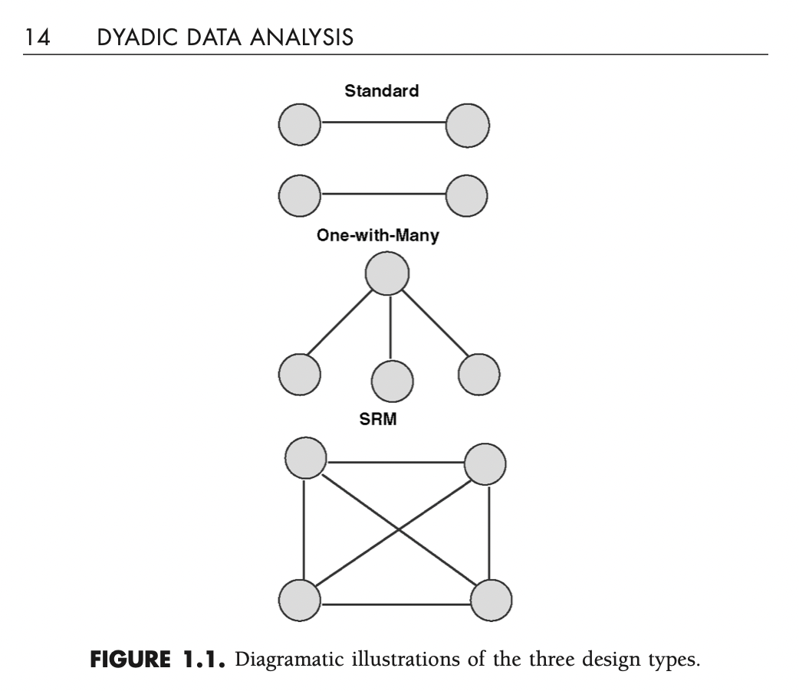
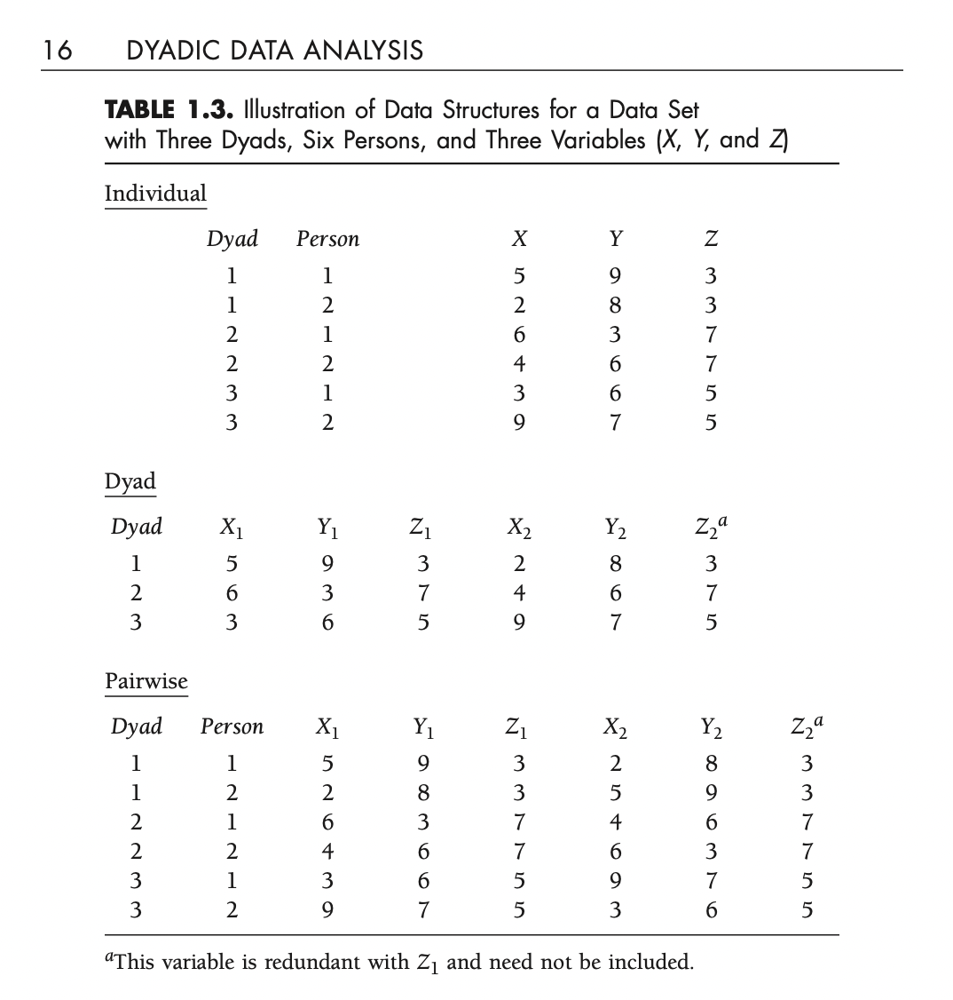

# Definitions

### Distinguishable dydas

Husband and wife
Advisor and PhD.Student
First and second author

### Indistinguishable dydas

Twins
Best friends (mutually chosen)
Roomates

---

# Variability

### Between dyads 

- Gender (if the study includes same and mix)
- Time together

### Withing dyads

-Gender (heterosexual couple)
-Time using the car (only one car)

**Same value for each dyad**

### Mixed variable

- Risk factor
- Age

---

# Dyadic design types




---

# Data structure

 

---


# Non independence

- More similar withing the dyad than the average

Consequences of non-independence?

---

# Libraries

```{r}
library(tidyverse)
library(reactable)

```
---

```{r}
the_data <- readRDS("data_risk.Rds") 
```

```{r}
reactable(the_data, defaultPageSize = 4,pagination = FALSE,
          highlight = TRUE, height = 450)
```

---
Filter data

```{r}
risk_data <- the_data %>% 
  group_by(ID, MEMBER) %>% 
  summarise(risk_factor=mean(answer, na.rm=T))
```

```{r}
reactable(risk_data, defaultPageSize = 4,pagination = FALSE,
          highlight = TRUE, height = 450)
```

---

# Pivot data

```{r}
risk_data_wide <- risk_data %>% 
  pivot_wider(names_from = MEMBER, 
  values_from=risk_factor, 
  id_cols = ID)

```

---

```{r}
ggplot(risk_data_wide, aes(Parent, Student)) + geom_point()
```


```{r}

mean_risk_factor <- 
  risk_data %>% ungroup() %>%  
  summarise(mean=mean(risk_factor, na.rm=T))

risk_data_wide %>% 
  ungroup() %>% 
  mutate(id=row_number()) %>% 
  pivot_longer(-c(id,ID)) %>% 
ggplot(.,
       aes(id, value, group=ID)) + 
  geom_point()+
  geom_line() + 
  geom_hline(yintercept =  1.53)


```

---

```{r}
risk_data_wide %>% 
  ungroup() %>% 
  mutate(id=row_number()) %>% 
  pivot_longer(-c(id,ID)) %>% 
ggplot(.,
       aes(id, value, color=name)) + 
  geom_point()+
  geom_hline(yintercept =  1.53)
```

---

```{r}

mod <- lm(risk_factor ~ 1, data = risk_data)
df <- augment(mod) %>% mutate(id=row_number())
ggplot(df, aes(x = id, y = .resid)) + geom_point()

mean_model <-   df %>%
  ggplot(aes(id, risk_factor)) + 
  geom_segment(aes(x = id, y = risk_factor,
                   xend = id, yend = .fitted), 
               alpha = 1, color = "gray") +
  geom_point(size = 2, color = "black") +
  geom_segment(aes(x = first, y = .fitted, xend = last, yend =.fitted), 
               data = function(x) {
                 x %>% 
                   summarize(first=first(id), last=last(id), 
                             .fitted=mean(.fitted), .groups="drop_last")
               }, color = "black", linetype = "dashed") +
  ggtitle("Fitted overall mean (with residuals)")

```

---

```{r}
mod <- lm(risk_factor ~ MEMBER, data = risk_data)
df <- augment(mod)  %>% mutate(id=row_number())
 
dyadic_model <-  df %>%
  ggplot(aes(id, risk_factor)) + 
  geom_segment(aes(x = id, y = risk_factor,
                   xend = id, yend = .fitted), 
               alpha = 1, color = "gray") +
  geom_point(size = 2, color = "black") +
  geom_segment(aes(x = first, y = .fitted, xend = last, yend =.fitted), 
               data = function(x) {
                 x %>% 
                   summarize(first=first(id), last=last(id), 
                             .fitted=mean(.fitted), .groups="drop_last")
               }, color = "black", linetype = "dashed") +
  ggtitle("Fitted overall mean (with residuals)")
```

---

```{r}
library(patchwork)

mean_model + dyadic_model
```

---

```{r}

library(lme4)
library(broom.mixed)

mod_r <- risk_data %>% 
  lmer(risk_factor ~ MEMBER + (1 | ID), data=.)

df_rmodel <- augment(mod_r)  %>% mutate(id=row_number())

df_rmodel %>%
  arrange(MEMBER) %>% 
  mutate(Subject = row_number()) %>% 
  ggplot(aes(Subject, risk_factor, color = MEMBER)) + 
  geom_point(size = 2) +
  geom_segment(aes(x = first, y = .fitted, xend = last, yend =.fitted), 
               data = function(x) {
                 x %>%
                   group_by(MEMBER) %>% 
                   summarize(first=first(Subject), last=last(Subject), 
                             .fitted=mean(.fitted), .groups="drop_last")
                 })  +
  
    geom_segment(aes(x = first, y = .fitted, xend = last, yend =.fitted), 
               data = function(x) {
                 x %>% 
                   summarize(first=first(Subject), last=last(Subject), 
                             .fitted=mean(.fitted), .groups="drop_last")
               }, color = "black", linetype = "dashed") +
  ggtitle("Fitted model means") + 
  scale_color_manual(values = c("#D81B60", "#1E88E5")) +
  theme_minimal()
```

---

```{r}
library(lme4)

risk_data %>% 
  lmer(risk_factor ~ MEMBER + (1 | ID), data=.) %>% 
  summary

library(MplusAutomation)

risk_data_mplus <- risk_data
risk_data_mplus[is.na(risk_data_mplus)] <- -999 
prepareMplusData(risk_data, "data.dat")

```


```{r}


sem_data <- the_data %>% 
  select(ID, MEMBER, VARNAME, answer) %>% 
  mutate(id=as.numeric(factor(ID))) %>% 
  mutate(Parent=case_when(MEMBER=="Parent" ~ 1,
                          MEMBER=="Student" ~ 0)) %>% 
  select(-ID, -MEMBER) %>% 
  pivot_wider(names_from = VARNAME, values_from = answer) %>% 
  arrange(id) 

sem_data[is.na(sem_data)] <- -999
prepareMplusData(sem_data, "data_sem.dat")

  

```

